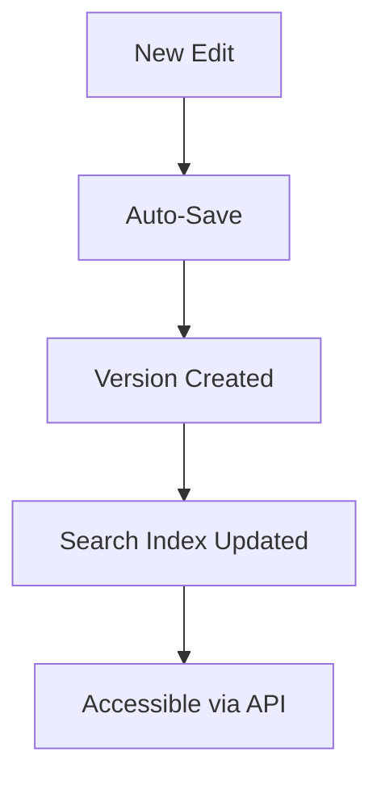

## Overview

Midhun Gk provides powerful tools to manage your project documentation. You organize content into folders, edit with rich formatting, collaborate securely, and search across versions effortlessly. These features streamline your workflow from creation to maintenance.

<Columns cols={2}>
  <Card title="Document Folders" icon="folder" href="#document-organization">
    Structure your docs hierarchically.
  </Card>
  <Card title="Editing Tools" icon="edit-3" href="#editing-tools">
    Rich markdown and formatting support.
  </Card>
  <Card title="Collaboration" icon="users" href="#collaboration">
    Team permissions and real-time edits.
  </Card>
  <Card title="Search & Versions" icon="search" href="#search-versions">
    Find content and track changes.
  </Card>
</Columns>

## Document Organization and Folders

Create a clear structure for your documentation using folders and subfolders. You nest documents logically, like `api/reference` or `guides/advanced`.

<Steps>
  <Step title="Create Folder" icon="folder-plus">
    Navigate to your workspace root. Click the new folder icon and name it `features`.
  </Step>
  <Step title="Add Document" icon="file-plus">
    Inside the folder, create a new MDX file named `authentication.mdx`.
  </Step>
  <Step title="Rearrange" icon="move">
    Drag folders to reorder or nest them dynamically.
  </Step>
</Steps>

<Callout kind="tip">
  Use consistent naming like `{kebab-case}` for folders to improve navigation.
</Callout>

## Editing and Formatting Tools

Edit documents with full MDX support, including components like `<Callout>` and code highlighting. You preview changes in real-time.

<Tabs>
  <Tab title="Markdown Basics" icon="code">
    Write standard markdown for headings and lists.

````markdown
## Heading

- List item
- Another item
````
  </Tab>
  <Tab title="Advanced Components" icon="layers">
    Embed interactive elements.

````jsx
<CodeGroup tabs="JavaScript,Python">
```javascript
console.log("Hello, Midhun Gk!");
```
```python
print("Hello, Midhun Gk!")
```
</CodeGroup>
````
  </Tab>
</Tabs>

## Collaboration and Permissions

Invite team members and set granular permissions. You control who views, edits, or admins documents.

| Role       | View | Edit | Admin |
|------------|------|------|-------|
| Viewer     | ✅   | ❌   | ❌    |
| Editor     | ✅   | ✅   | ❌    |
| Admin      | ✅   | ✅   | ✅    |

<Callout kind="alert">
  Always review permissions before sharing sensitive docs to prevent unauthorized access.
</Callout>

To add a collaborator:

```bash
curl -X POST https://api.example.com/workspaces/{workspaceId}/invites \
  -H "Authorization: Bearer YOUR_TOKEN" \
  -d '{"email": "user@example.com", "role": "editor"}'
```

## Search and Version Control

Search across all documents with full-text indexing. Track changes via version history.

<ExpandableGroup>
  <Expandable title="Basic Search" default-open="true">
    Use the global search bar to query terms like "authentication".

    ```javascript
    // API example
    const results = await fetch('https://api.example.com/docs/search?q=auth');
    ```
  </Expandable>
  <Expandable title="Version History">
    View diffs and restore previous versions.

    Each edit creates a commit-like snapshot. Compare changes side-by-side.
  </Expandable>
</ExpandableGroup>



These features make Midhun Gk your go-to for scalable documentation. Start organizing today for better team productivity.